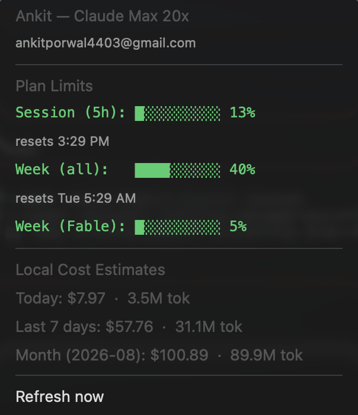

# Claude Usage Tracker (macOS Menu Bar)


A SwiftBar plugin that shows your **real Claude Code plan usage** in the macOS menu bar — the same numbers as the `/usage` command inside Claude Code.

<p align="center">
  
</p>

## What it shows

**Menu bar:** `✳ 6% · wk 15%` — current 5-hour session usage and weekly usage.

**Dropdown (click the icon):**

```
Abhijeet — Claude Max 20x
you@example.com
─────────────────────────
Plan Limits
Session (5h): █░░░░░░░░░ 6%    resets 4:00 PM
Week (all):   ██░░░░░░░░ 15%   resets Tue 8:30 AM
Week (Opus):  █░░░░░░░░░ 5%
─────────────────────────
Local Cost Estimates
Today:        $4.88  ·  1.9M tok
Last 7 days:  $54.67 ·  29.5M tok
Month:        $97.80 ·  88.3M tok
─────────────────────────
Refresh now
```

Progress bars turn **orange at 50%** and **red at 80%**. Refreshes every 2 minutes.

## Requirements

- macOS with [Homebrew](https://brew.sh)
- [Claude Code](https://claude.com/claude-code) installed and **logged in at least once** (the tracker reuses its login)

## Install

```bash
git clone https://github.com/AnkitPorwal04/claude-usage-tracker.git
cd claude-usage-tracker
./install.sh
```

The script installs anything missing (Node, [ccusage](https://ccusage.com), [SwiftBar](https://swiftbar.app)), copies the plugin to `~/.swiftbar-plugins/`, points SwiftBar at that folder, and launches it.

> **First run:** macOS will ask permission to read the `Claude Code-credentials` Keychain item. Click **Always Allow**.

### Manual install

If you'd rather not run the script:

```bash
brew install node
brew install --cask swiftbar
npm install -g ccusage

mkdir -p ~/.swiftbar-plugins
cp claude-usage.2m.js ~/.swiftbar-plugins/
chmod +x ~/.swiftbar-plugins/claude-usage.2m.js
defaults write com.ameba.SwiftBar PluginDirectory "$HOME/.swiftbar-plugins"
open -a SwiftBar
```

On Intel Macs, edit the first line of the plugin and the `CCUSAGE` constant to match your paths (`which node` / `which ccusage`) — the install script does this automatically.

## How it works

| Data | Source |
|---|---|
| Plan limit percentages & reset times | Anthropic OAuth usage API (`api.anthropic.com/api/oauth/usage`), authenticated with the Claude Code token stored in your macOS Keychain |
| Account name / email / plan | `~/.claude.json` |
| Cost & token estimates | [ccusage](https://ccusage.com) reading local Claude Code logs in `~/.claude/projects` |

Nothing is sent anywhere except the single authenticated request to Anthropic's own API. Cost figures are *estimates* at API pricing — on Max/Pro plans treat them as "value used", not a bill.

## Customizing

- **Refresh interval:** rename the file — `claude-usage.30s.js` (30 sec), `claude-usage.5m.js` (5 min), etc.
- **Start at login:** SwiftBar menu bar icon → Preferences → *Launch at Login*.

## Troubleshooting

| Symptom | Fix |
|---|---|
| `✳ ⚠︎` in the menu bar | Your Claude Code token expired — open Claude Code once, then click *Refresh now*. |
| No icon appears | Check SwiftBar is running and its plugin folder is `~/.swiftbar-plugins` (SwiftBar → Preferences → Plugin Folder). |
| Keychain prompt loops | Open Keychain Access, find `Claude Code-credentials`, and grant SwiftBar/node access, or click *Always Allow* on the prompt. |
| Costs show $0.00 | You haven't used Claude Code on this machine yet, or logs live elsewhere (`ccusage daily` should show data). |

## Credits

- [SwiftBar](https://swiftbar.app) — menu bar plugin host
- [ccusage](https://ccusage.com) — local Claude Code usage analysis

## License

[MIT](LICENSE)
